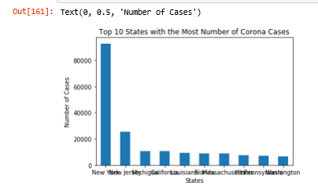

# WebScraping
Webscrapes from various websites

# Webscraping.ipynb 
Scrapes from: A sample website, imdb, and indeed.

# Webscraping.ipynb
Scrapes from multiple sites like coronavirus, university's catalog, wikipedia
Creates graphs and dataframes.
One tool uses selenium 

The graph doesn't work anymore but when it did it looked like this

